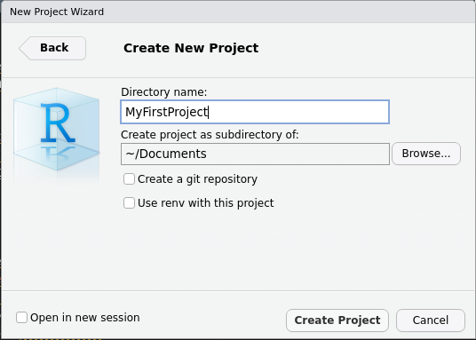
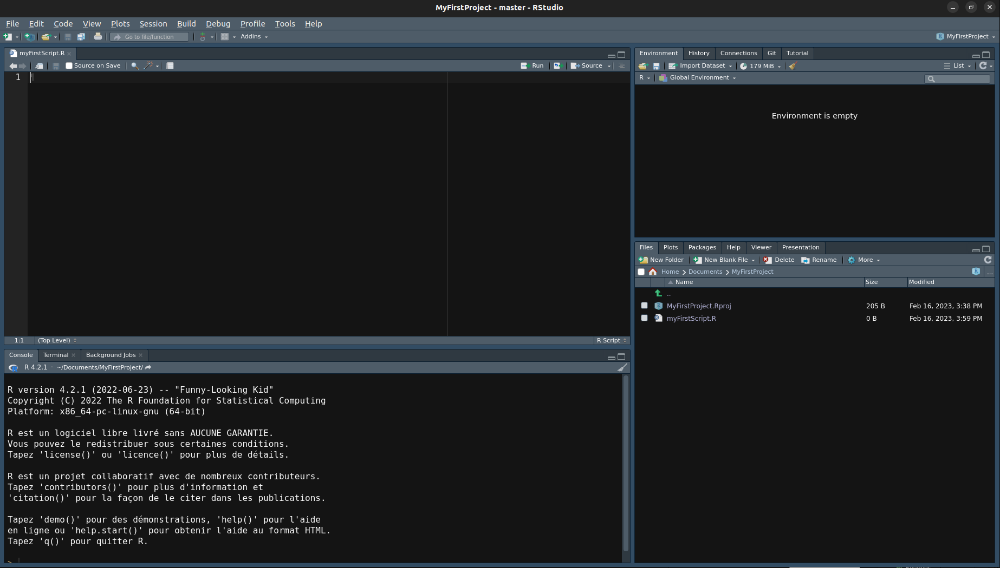

--- 
title: "Initiation au langage R"
author: "Cédric HASSEN-KHODJA"
site: bookdown::bookdown_site
documentclass: book
bibliography: packages.bib
description: |
  Initiation au langage de programmation, R
link-citations: yes
---

# R

## Qu'est-ce que le logiciel R ?

R^[http://www.r-project.org/] est un **langage de programmation** et un **environnement de développement** (posit) 
utilisés pour le calcul statistique et la visualisation des données. Il est largement 
utilisé par les scientifiques, les analystes et les développeurs pour **analyser et visualiser des données, développer des applications et créer des algorithmes**. 
Il offre une variété de fonctionnalités, notamment des outils pour le traitement 
et la manipulation de données, des **packages** pour le traitement des données et des bibliothèques pour le traitement des données.  

R[@R-base] est disponible pour de nombreuses plateformes, notamment **Windows, Mac OS X et Linux**.
Il est également disponible sous forme de packages pour les systèmes d'exploitation populaires, tels que Ubuntu, Red Hat et Debian.

## Installer R

Pour installer R sous Windows, Linux ou macOS vous devez d'abord télécharger le package d'installation à partir du **site Web officiel de R (CRAN)** ou sur un de ses miroir^[miroir basé à Lyon, https://pbil.univ-lyon1.fr/CRAN/].\

- Sous Windows ou sous MacOS, une fois le package téléchargé, double-cliquez sur le fichier d'installation et suivez les instructions à l'écran pour compléter l'installation.\
- Sous Linux^[https://pbil.univ-lyon1.fr/CRAN/bin/linux/], suivez les instructions à l'écran pour faire l'installation de R.

## RStudio Desktop 

RStudio Desktop est une application de bureau qui offre une **interface utilisateur graphique** (GUI) pour le
langage de programmation R. Il fournit un **environnement de développement** intuitif pour le codage, le débogage et la visualisation des données. Il offre également des outils pour l'analyse statistique, le traitement des données et la génération de rapports. RStudio Desktop^[https://posit.co/download/rstudio-desktop/] est disponible pour Windows, Mac OS X et Linux.\
Pour avoir un aperçu des différentes possibilités qu'offre l'interface vous pouvez récupérer le cheat sheet^[https://raw.githubusercontent.com/rstudio/cheatsheets/main/rstudio-ide.pdf] dédié.

Pour commencer, vous pouvez créer un nouveau projet R en utilisant le menu **File > New project**. Dans
la fenêtre suivante, choisissez **New directory** pour créer un répertoire de travail sur votre ordinateur ou
**Open directory** si vous avez déjà un répertoire de travail. Dans la fenêtre suivante, choisissez **New Project** et créez un répertoire **MyFirstProject** sur le bureau (ou ailleurs) et validez par **Create Project**.\



Créez un nouveau script R à l’intérieur du projet **MyFirstProject** en utilisant **File -> New File** et
choisissez **Rscript**. Le nouveau script est ouvert dans une fenêtre **Untitled1**. Pour
l’enregistrer, utilisez **File -> Save as** et donnez-lui un nom, par exemple **MyFirstScript**.\
Il est automatiquement enregistré dans le répertoire MyFirstProject. Fermez RStudio avec **File -> Quit Session**.\ 



Vérifiez que dans le répertoire MyFirstProject vous avez maintenant ces trois éléments :

- un dossier .Rproj.user
- un fichier MyFirstProject.Rproj
- un script myFirstScript.R

## Quelques commandes de base R

> 
- install.packages() : installe un package R.
- library() : charge un package R.
- search() : recherche un package R.
- update.packages() : met à jour un package R.
- remove.packages() : supprime un package R.
- options() : affiche les options de configuration R.
- setwd() : définit le répertoire de travail R.
- getwd() : affiche le répertoire de travail R.
- save.image() : sauvegarde l'environnement R. 

Voici les sorties de quelques commandes pré-citées :

```{r cmd}
install.packages("dplyr")
library("dplyr")
getwd()
```